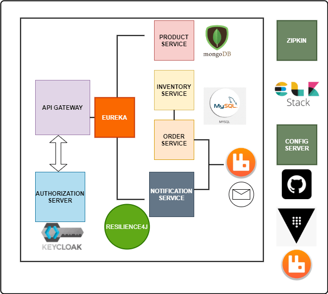

# Microservices

> source : [Programming Techie](https://youtube.com/playlist?list=PLSVW22jAG8pDY3lXXEv1hKVIAlnJ9nDN_)

> central config server used : [Central Config Server](https://github.com/krishna-sk/central-config-server)
### Table of Contents

- [Product Service Microservice](https://github.com/krishna-sk/online-shopping/tree/master/product-service)



#### Config Server

- Config server reads the common properties from the GitRepository [central-config-server](https://github.com/krishna-sk/central-config-server)
- we create the application.yml in the GitRepository and the properties in this file is read by all the microservices.
- First the properties in application.yml file in the GitRepository is copied to the config server and from there all the microservices read this properties.
- We can provide microservice specific properties in the central config server(GitHub Repository) also. We need to write file name as microserviceName.yml or microSercice.properties.

##### [Hashicorp Vault](https://learn.hashicorp.com/vault)

#### Spring Boot and Spring Cloud are not compatible with latest versions. So, here we are using Spring Boot Version 2.3.2.RELEASE and Spring Cloud Version Hoxton.SR8

- We store our secrets related to the microservices in the Hashicorp vault like database username, password, JWT Secret Key, API Keys.
- Here for development and testing purpose we are storing in InMemory. Once We stop the server we need to store them again.

#### Steps to store secrets into the Hashicorp Vault

1. Open the command prompt and Start the Hashicorp Vault Server in dev mode

```properties
vault server -dev
```

2. open new command propmt and set the vault address you got in the first command prompt

```properties
set VAULT_ADDR=http://127.0.0.1:8200
```

3. Copy the token and paste it somewhere as we need to use it in bootstrap.yml/properties file.

```properties
Unseal Key: DuOI+bq0jIk59hTPbYposhbnBGUItHiNnjq9QdRYTpQ=
Root Token: s.pDnBHR7pXHaNngc3S49v18gy
```

4(a). Add secrets into the vault

```properties
vault kv put secret/{application-name} key1=value1 key2=value2 and so on
```

4(b). We can add using json file also. store all the keys and values into json file as a key value pair and store.

```properties
vault kv put secret/{application-name} @file_name.json
```

#### botstrap.yml file

```properties
spring:
  application:
    name: order-service   # use this name as application name to store into vault {application-name}
  cloud:
    vault:
      kv:
        enabled: true
      scheme: http
      authentication: TOKEN
      token: {vault_root_token}
```

### here user, pass are keys that we used to store database credentials in vault

#### application.yml file

```properties
server:
  port: 0 #Random Port
spring:
  datasource:
    driver-class-name: com.mysql.cj.jdbc.Driver
    url: jdbc:mysql://localhost:3306/order-service
    username: ${user}        # username, password are retrieved from hashicorp vault
    password: ${pass}        # here user,pass are keys in vault
  application:
    name: order-service
  config:
    import: optional:configserver:http://localhost:8888   # Config Server Location
eureka:
  client:
    serviceUrl:
      defaultZone: http://localhost:8761/eureka/
  instance:
    instance-id: ${spring.application.name}:${random.uuid}
#actuator
management:
  endpoints:
    web:
      exposure:
        include: "*"
```
